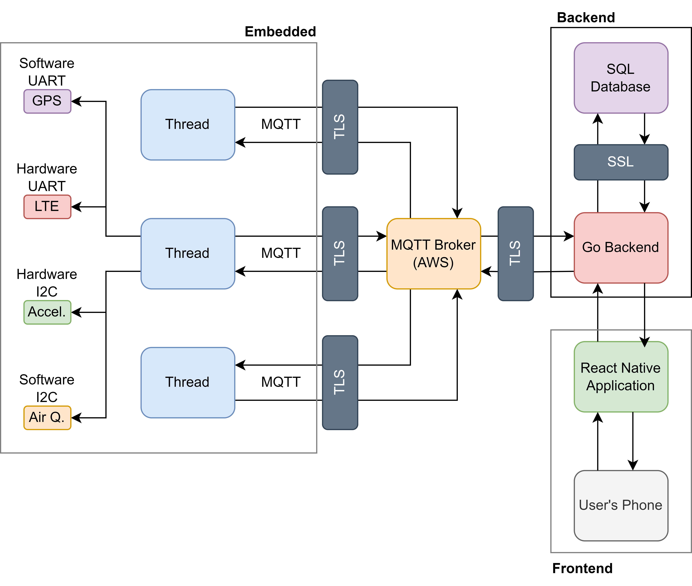

# [_AutoEye_](https://nethercrafter9.wixsite.com/auto-eye)

_A Car Theft Detection Device which instantly notifies you when your car is stolen & maximises your chances of recovery_

## _Description_

_AutoEye is a vehicle theft detection system that contains a GPS, Accelerometer, Temperature/Humidity, & LTE Connectivity to provide instant notifications & an intuitive app interface to notify the user when their vehicle has been stolen._

_By placing the device in the car & locking it in the app - the system will detect any suspicious activity & instantly alert the user, maximising the chances of recovery._

Note: all keys have been removed from this project, please generate new keys before building/running.

## Features

- _Real Time Car Theft Detection_
- _Instant Push Notifications_
- _Intuitive App Interface_
- _GPS Tracking & LTE Connectivity for Accurate Location Updates_
- _Secure & Encrypted Communication with TLS over MQTT & HTTP_
- _Multiple Device Support_

## Setup

1. _Purchase an AutoEye_
2. _Install the App_
3. _Create an Account_
4. _Add the Device_
5. _Lock your car when you park on the app_

## _Communication_

